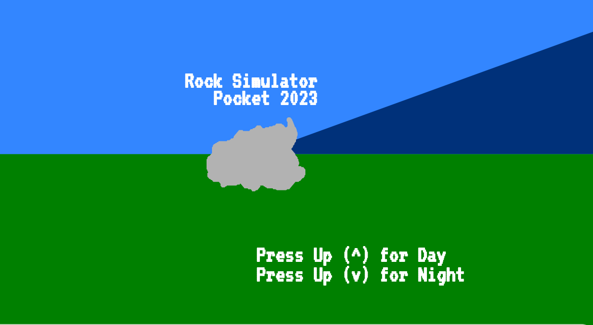
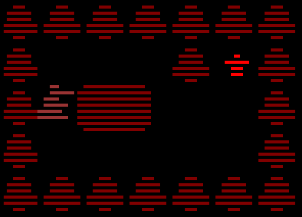
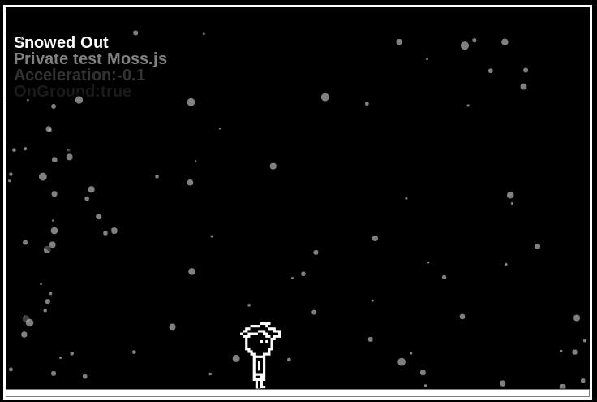
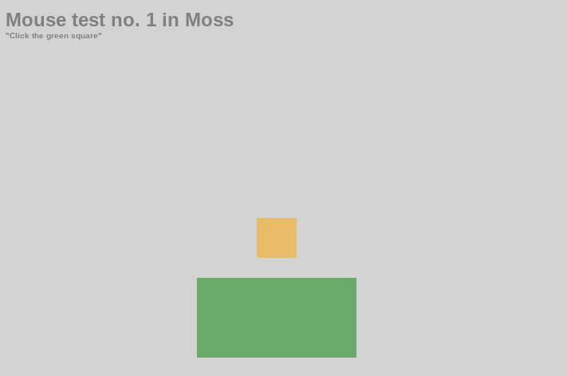

> The <em>successor</em> to <a href="https://github.com/creativeDrawerStudios/eSharpBeta"><b>eSharp</b></a> <br/>
> Includes drawing, studio commands, and optional functions for repetetion.

``` js
 //This is a project made in moss.js
 let screenX = window.innerWidth;
 let screenY = window.innerHeight;
 let centerX = screenX / 2;
 let centerY = screenY / 2;
 createCanvas(screenX,screenY);
 bg("#00cfEE");
 strokeSize(5);
 strokeColor("#000000");
 selectColor("#ff00cE");
 rect(centerX-50,centerY-50,100,100);
```
## How to make a new project

### Start with a new html document

``` html
<!DOCTYPE html>
<html>
 <head>
  <title>myFirstMossProject</title>
 </head>
 <body>
  <p align="center">
   <canvas id="myCanvas"></canvas>
  </p>
  <script src="https://classicmc-studios.github.io/js/moss.js"></script>
  <script src="main.js"></script>
 </body>
</html>
```

#### Create a new js file called main.js

``` js
createCanvas(720,480);
bg("#00cc00",0.1);
strokeColor("#000000");
selectColor("#ffffff");
rect(720/2-50,480/2-50,100,100);
```

> Need more help? Visit <a href="https://classicmc-studios.github.io/ejs/">Ethans MossJs course</a>  

## Moss project examples

### [Rock Simulator 2023](https://classicmc-studios.github.io/rs23)



### [Old man concequences](https://classicmc-studios.github.io/omc)



### [Snowed out](https://classicmc-studios.github.io/snoout)



### [Moss mouse test no. 1](https://classicmc-studios.github.io/mmt)




